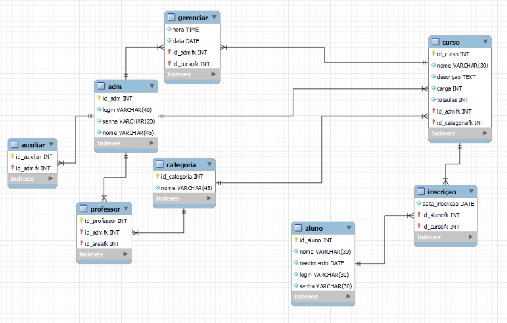

# Projeto Banco de Dados
## 📝 Descrição: 
Projeto para a disciplina de Banco de dados que simula o funcionamento de uma plataforma de cursos de várias categorias, com Java e Hibernate.

## 💻 Como acessar:
1️⃣. Tenha uma IDE (Sugestão: Vs code);

2️⃣. Clonar o repositório com o comando abaixo:
``` 
git clone git@github.com:mrikele/projeto-bd.git
```

## 🗺 Modelo conceitual:


## 📝 Licença

Esse projeto está sob licença. Veja o arquivo [LICENÇA](LICENSE.md) para mais detalhes.
